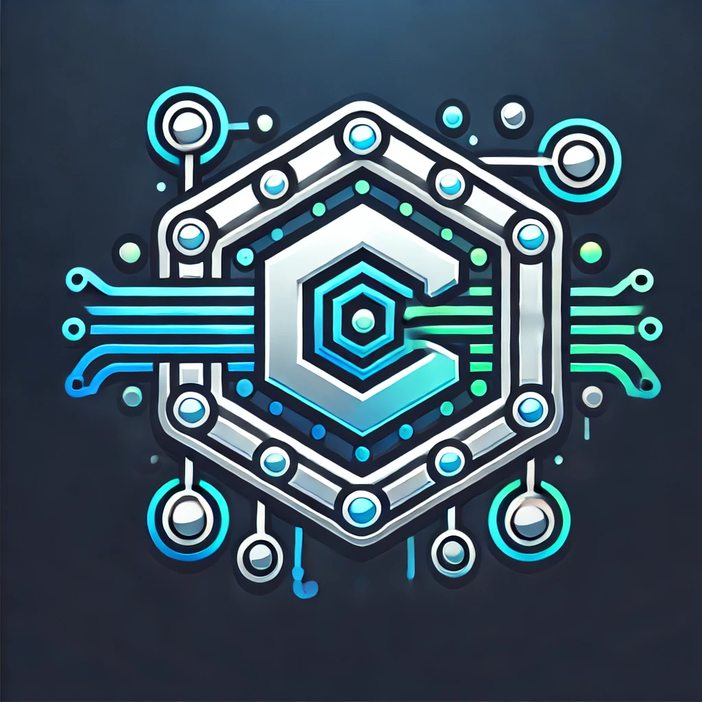

### **Crypton: Your Gateway to Blockchain Mastery**  

  

**What is Crypton?**  
Crypton is an innovative blockchain-based educational game designed to make learning about cryptocurrency, blockchain, and Web3 technologies simple, engaging, and accessible. By gamifying the learning process, Crypton turns complex concepts like NFTs, DeFi, and smart contracts into interactive and fun experiences, empowering users to explore the decentralized world with confidence. 🚀

### **How Does Crypton Work?**  

1. **Choose Your Path** 🎮  
   - Navigate to the "Games" section and select a lesson or challenge that matches your interest and skill level.  
   - Topics include blockchain basics, cryptocurrency trading, NFT creation, DeFi applications, and more.  

2. **Interactive Learning** 💡  
   - Each lesson combines engaging content with real-world blockchain simulations.  
   - Understand blockchain mechanics like transactions, tokenomics, and staking through hands-on activities.  

3. **Rewards System** 🏆  
   - Earn NFTs, tokens, and badges as you complete lessons and challenges.  
   - Build a personal collection of blockchain assets that you can showcase or trade.  

4. **Track Your Progress** 📊  
   - Use the intuitive dashboard to monitor your learning journey.  
   - Unlock new achievements and move closer to becoming a blockchain pro.  

### **Why Crypton?**  
- **Accessible for Beginners:** Simplifies blockchain concepts with engaging visuals and gamified lessons.  
- **Reward-Driven:** Keeps users motivated with tangible rewards like NFTs and tokens.  
- **Interactive Simulations:** Demonstrates real blockchain mechanics in a risk-free environment.  
- **Comprehensive Learning:** Covers a broad range of blockchain topics, ensuring users grasp both fundamentals and advanced concepts.  

### **Who is Crypton For?**  
Crypton is ideal for:  
- Blockchain enthusiasts eager to deepen their knowledge. 🌐  
- Gamers interested in earning NFTs and tokens while learning. 🎮  
- Beginners stepping into the world of cryptocurrency and Web3 technologies. 🧑‍💻  
- Educators and trainers looking for an engaging platform to teach blockchain concepts. 📚  

### **Key Features**  
1. Interactive games that teach blockchain fundamentals. 🎲  
2. Real-world simulations of transactions, smart contracts, and staking. 💰  
3. NFT and token rewards for progress and achievements. 🎉  
4. Seamless Web3 wallet integration for a personalized experience. 🦊  
5. A progress dashboard to monitor achievements and unlock new challenges. 📈  

Crypton is more than just a game—it’s an immersive journey into the future of technology and finance. Learn, play, and master blockchain concepts with Crypton! 🌟

### Contributor
[Anidipta Pal](https://github.com/Anidipta)
